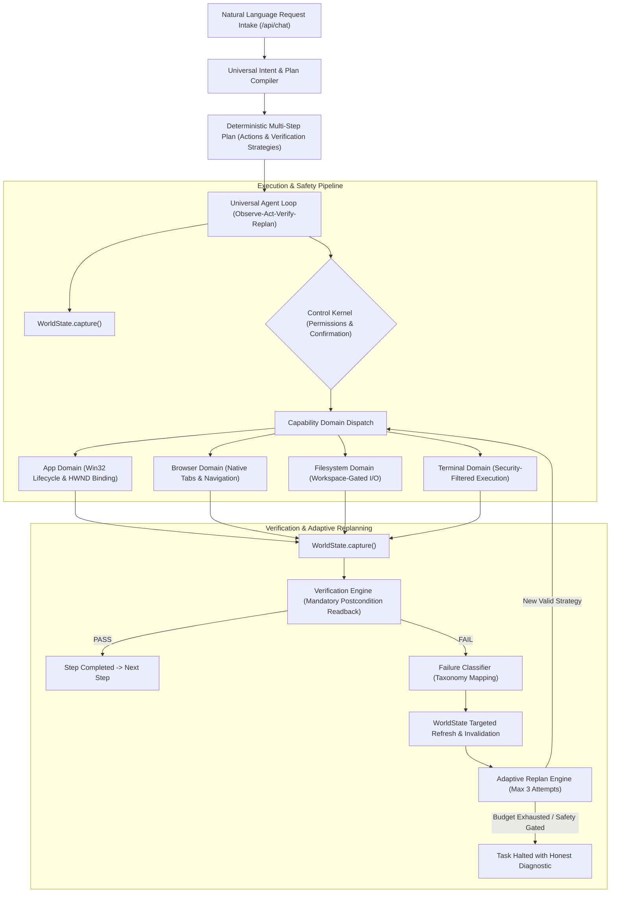

# PLUTON V2 Canonical Architecture Specification

PLUTON V2 is a deterministic, evidence-based computer automation and agentic pairing substrate. Reasoning, planning, target resolution, execution domains, and postcondition verification are strictly decoupled.

---

## 1. System Topology & Core Subsystems

---

## 2. Core Architecture Tenets

1. **Zero Hardcoding**: No application names, URLs, arithmetic expressions, process names, or UI element selectors are hardwired into procedural decision logic.
2. **Action vs Target Separation**: Targets represent addressable entities (applications, URLs, HWNDs, tabs, files). Actions represent capabilities (`app.launch`, `keyboard.type`, `browser.navigate`). Actions and parameters are never falsely routed through `TargetResolver`.
3. **Mandatory Postcondition Verification**: No tool call is considered complete merely because `tool_res.status == "completed"`. Physical evidence must be confirmed in the environment (`UIA_READBACK`, `WINDOW_PRESENCE`, `BROWSER_TAB_PRESENCE`, `FILESYSTEM_CHECK`, `DOM_VALUE_MATCH`).
4. **Bounded Adaptive Replanning**: Step verification failures trigger automated failure classification, state refresh, and materially different alternative strategy selection (capped strictly at 3 attempts per step). Safety confirmations and ambiguous target refusals cannot be bypassed by replanning.
5. **Universal Multi-Source Target Resolution**: Target discovery dynamically probes live windows, browser tabs, loopback web services (e.g. `http://127.0.0.1:5173`), desktop registry paths, and filesystem items using evidence scoring and ambiguity gating.