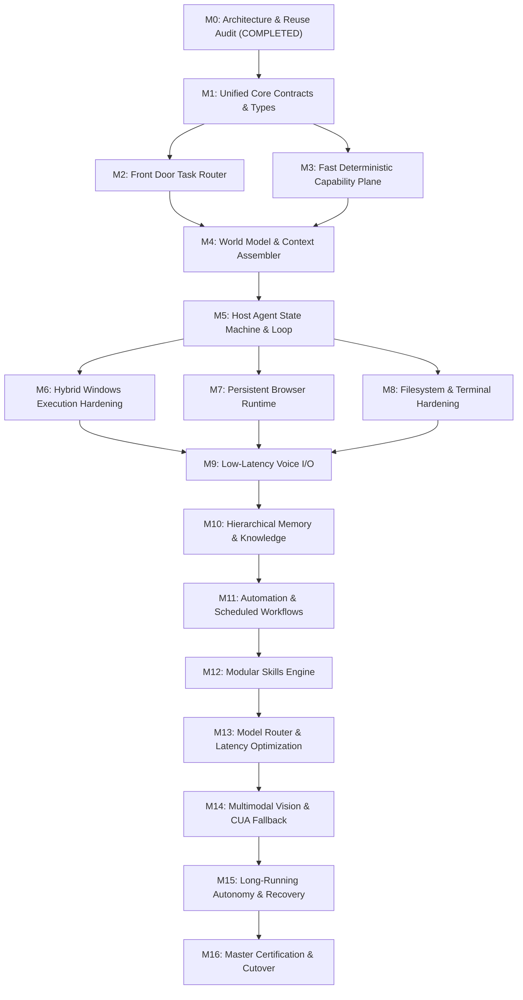

# PLUTON V2 — MASTER MIGRATION PLAN & MILESTONE ROADMAP

---

## 1. Executive Migration Strategy

The migration from the current codebase to the full **Jarvis / Ultron Personal AI Assistant** architecture follows an **In-Place Substrate Wrapping & Layered Orchestration** approach rather than a destructive big-bang rewrite.

### Guiding Principles:
1. **Preserve Proven Substrates:** The Win32 execution engine, `TargetResolver`, `WorldState`, `VerificationEngine`, `ControlKernel`, `InputInterceptor`, and `CapabilityRegistry` are battle-tested and represent hundreds of hours of hardening. They will be wrapped behind clean domain worker interfaces.
2. **Layered Front-Door Decoupling:** Non-computer tasks (general conversation, math, system time, memory recall) will be routed away from the heavy semantic planner via a fast, sub-10ms deterministic front-door classifier.
3. **Continuous Regression Testing:** Every milestone executes the 33 backend tests, 11 frontend tests, and hardcoding audit before acceptance.

---

## 2. Milestone Implementation Sequence

### Detailed Milestone Breakdown

| Milestone ID | Objective | Subsystems Affected | Key Deliverables & Interfaces | Exit Criteria |
| :--- | :--- | :--- | :--- | :--- |
| **M0** | Master Repository & Reuse Audit | Full Repository | `MILESTONE_0_REPOSITORY_AUDIT.md`, `THIRD_PARTY_REUSE_PLAN.md`, `KNOWN_FAILURES.md`, `MIGRATION_PLAN.md` | Audit complete, 0 regressions, all tests passing. |
| **M1** | Unified Core Contracts & Types | `backend/app/core/contracts.py` | Canonical task types, user intent classes, execution domain contracts, evidence tokens. | Types strictly validated with Pydantic & dataclasses. |
| **M2** | Front Door Task Router | `backend/app/agent.py`, `backend/app/router/` | Fast $< 10\text{ms}$ intent classifier separating conversation, fast tools, and complex computer tasks. | 100% of conversational queries bypass computer planner. |
| **M3** | Fast Capability Plane | `backend/app/fast_plane/` | Deterministic Math AST evaluator, system clock/timezone, workspace info provider. | Math & system queries resolve in $< 1\text{ms}$ with zero LLM calls. |
| **M4** | World Model & Evidence Context | `backend/app/core/world_state.py`, `planner_context.py` | Selective context builder injecting active window, open tabs, recent files, and live system state. | Context assembly latency $< 0.1\text{ms}$. |
| **M5** | Host Agent State Machine | `backend/app/agent.py`, `core/agent_loop.py` | Asynchronous host agent coordinating conversation, tool dispatch, and Observe-Act-Verify-Replan loop. | Streaming chat and multi-turn dialogues execute cleanly. |
| **M6** | Hybrid Windows Execution | `backend/app/subsystems/computer/domains/` | Windows AppWorker, WindowWorker, UIA tree traversal, and exact executable matching. | App launch/focus/minimize/maximize 100% verified. |
| **M7** | Persistent Browser Runtime | `backend/app/subsystems/computer/browser_engine.py` | Native multi-browser tab controller, omnibox navigation, and CDP session manager. | Tab open, close, switch, and URL load 100% verified. |
| **M8** | Filesystem & Terminal Hardening | `backend/app/subsystems/computer/domains/filesystem.py`, `terminal.py` | Workspace-gated file operations and filtered terminal command execution. | 100% exit code verification and path containment. |
| **M9** | Low-Latency Voice I/O | `backend/app/voice/` | Faster-Whisper local STT and Piper / Edge-TTS audio output engine with WebAudio streaming. | End-to-end voice roundtrip latency $< 800\text{ms}$. |
| **M10** | Hierarchical Memory & Knowledge | `backend/app/memory/` | SQLite episodic history + ChromaDB / SQLite-vec vector memory for user facts and preferences. | Semantic recall latency $< 15\text{ms}$. |
| **M11** | Automation & Scheduled Tasks | `backend/app/automation/` | Background asyncio cron scheduler, recurring job daemon, and task progress notifications. | Timers, recurring crons, and reminders execute reliably. |
| **M12** | Modular Skills Engine | `backend/app/skills/` | Declarative skill manifest loader (`skills/<skill_name>/manifest.yaml`), custom capability contracts. | Dynamic skill discovery without modifying core code. |
| **M13** | Model Router & Latency Optimization | `backend/app/providers/` | Task-complexity-based model routing (`auto` $\to$ `llama-3.1-70b` $\to$ `fast commercial fallback`). | Planning latency reduced while preserving structured output. |
| **M14** | Multimodal Vision & CUA Fallback | `backend/app/subsystems/computer/domains/vision.py` | Visual element grounding fallback when Windows UIA tree accessibility is absent. | Visual bounding box click and OCR verification. |
| **M15** | Long-Running Autonomy & Recovery | `backend/app/core/agent_loop.py` | Bounded checkpointing, crash resumption, and persistent background task supervision. | Resumes interrupted tasks from last verified state. |
| **M16** | Master Certification & Cutover | Full Stack | Complete test suite, end-to-end regression benchmark, hardcoding audit (0 rules), live cutover. | 100% passing across all acceptance criteria. |

---

## 3. Subsystem Migration Mapping

| Current Subsystem File | Target Architecture Location | Migration Action | Rationale |
| :--- | :--- | :---: | :--- |
| `backend/app/core/world_state.py` | `backend/app/core/world_state.py` | **PRESERVE IN PLACE** | Proven, robust environment capture substrate. |
| `backend/app/subsystems/computer/target_resolver/` | `backend/app/subsystems/computer/target_resolver/` | **PRESERVE IN PLACE** | Multi-source dynamic evidence scoring is production-ready with 0 hardcoding. |
| `backend/app/verification/verification_engine.py` | `backend/app/verification/verification_engine.py` | **PRESERVE IN PLACE** | Physical postcondition verification is authoritative. |
| `backend/app/kernel/control_kernel.py` | `backend/app/kernel/control_kernel.py` | **PRESERVE IN PLACE** | Strict security boundary and permission token gatekeeper. |
| `backend/app/kernel/input_interceptor.py` | `backend/app/kernel/input_interceptor.py` | **PRESERVE IN PLACE** | Hardware lockout during idle state is non-negotiable. |
| `backend/app/subsystems/computer/domains/` | `backend/app/subsystems/computer/domains/` | **PRESERVE & WRAP** | Domain execution handlers are robust; wrap behind worker interfaces. |
| `backend/app/subsystems/computer/browser_engine.py` | `backend/app/subsystems/computer/browser_engine.py` | **PRESERVE & EXTEND** | Native browser tab and omnibox controller is production-ready. |
| `backend/app/planning/semantic/` | `backend/app/planning/semantic/` | **PRESERVE & INTEGRATE** | Semantic planner and capability schema registry are hardened and cached. |
| `backend/app/agent.py` | `backend/app/agent.py` | **ADAPT** | Integrate front-door router and state machine coordination. |
| `backend/app/planning/intent_compiler.py` | `backend/app/planning/legacy/` | **DEPRECATE** | Legacy regex intent compiler will be fully replaced by M2 front-door router. |