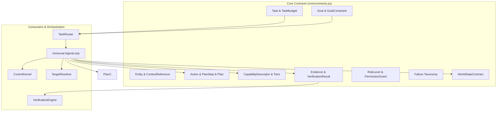

# PLUTON V2 — CORE CONTRACTS & CANONICAL TYPE SYSTEM SPECIFICATION

---

## 1. Architectural Authority & Overview

This specification establishes the canonical contract and type system for **PLUTON V2** located in `backend/app/core/contracts.py`.

The contract layer is the foundational, zero-dependency data substrate connecting:
- User Interaction & Front-Door Router
- Fast Deterministic Capability Plane
- Host Agent & Universal Execution Loop
- TargetResolver & World State Engine
- Physical Execution Workers (Win32, Browser, Filesystem, Terminal, Input)
- Verification & Evidence Engine
- ControlKernel & Input Interceptor
- Long-Term Memory & Automation Subsystems

---

## 2. Canonical Contracts & Ownership Matrix

| Canonical Contract | Purpose / Semantic Scope | Authoritative Source | Allowed Mutators | Physical Execution Dependencies |
| :--- | :--- | :--- | :--- | :---: |
| **`Task`** | Top-level unit of user intent, origin channel, budget, lifecycle status. | Host Agent / Router | State Machine only | `NONE` |
| **`Goal`** | Pure user objective, success criteria, and constraints ("WHAT"). | Semantic Planner / Fast Plane | Router / Planner | `NONE` |
| **`Entity`** | Semantic representation of a system entity (file, app, window, URL). | TargetResolver / Context | TargetResolver | `NONE` |
| **`ContextReference`** | Symbolic reference to runtime targets (`active_window`, `previous_target`). | User input / Planner | TargetResolver | `NONE` |
| **`CapabilityDescriptor`**| Formal specification of an executable primitive, tiers, schemas, and risks. | CapabilityRegistry | Registry only | `NONE` |
| **`Action`** | Authorized executable intent with parameters, preconditions, and risk level. | Planner / Fast Plane | Kernel / Normalizer | `NONE` |
| **`PlanStep` & `Plan`** | Deterministic ordered sequence of actions with dependencies and verifications. | Planner / Normalizer | AgentLoop | `NONE` |
| **`Evidence`** | Trusted runtime observation with timestamp, source, and confidence. | Verification / WorldState | VerificationEngine | `NONE` |
| **`VerificationResult`** | Verified outcome (`PASS`, `FAIL`, `UNKNOWN`, `NOT_APPLICABLE`) with evidence link. | VerificationEngine | VerificationEngine | `NONE` |
| **`Failure`** | Typed failure taxonomy classification with recovery / replan metadata. | AgentLoop / ReplanEngine | ReplanEngine | `NONE` |
| **`RiskLevel` & `Permission`** | Authorization classification (`LOW`, `MEDIUM`, `HIGH`, `CRITICAL`). | Policy / Kernel | ControlKernel | `NONE` |
| **`WorldStateContract`**| Snapshot schema of active windows, tabs, processes, and recent files. | WorldState Capture | WorldState Engine | `NONE` |

---

## 3. Strict Boundary Rules, Validation & Anti-Patterns

1. **Explicit Validation (No Silent Reinterpretation):**
   - Invalid enums raise `ContractValidationError` immediately.
   - Non-positive timeouts, negative budgets, out-of-bounds confidences ($c 
otin [0, 1]$), and negative latencies are explicitly rejected.
   - Malformed timestamp strings raise `ContractValidationError` rather than falling back to current system time.
   - Required string fields (`Task.user_request`, `Goal.objective`, `CapabilityDescriptor.capability_id`, `CapabilityDescriptor.name`, `Evidence.source`, `Failure.message`) reject empty or whitespace-only inputs.
2. **Zero Hardcoded Runtime Defaults:**
   - Contracts do not default `active_browser` or `browser_name` to `"Brave"`, `"Chrome"`, or `"Edge"`. Default is strictly `None` until populated by trusted runtime state.
3. **Pure Single Risk Hierarchy:**
   - Canonical contracts (`Action`, `CapabilityDescriptor`, `PermissionGrant`) exclusively use `RiskLevel` (`LOW`, `MEDIUM`, `HIGH`, `CRITICAL`).
   - `PermissionStatus` (`REQUESTED`, `GRANTED`, `DENIED`, `CONFIRMATION_REQUIRED`, `EXPIRED`) handles authorization states.
   - Legacy `Permission` (`low`, `medium`, `high`) is isolated in `backend/app/core/adapters.py`.
4. **Physical Identity Separation:**
   - `ContextReference` distinguishes semantic references (`raw_reference`, `ref_type`) from physical bindings (`runtime_target_binding`, `is_runtime_bound`), ensuring model outputs cannot synthesize unverified HWND/PID/path bindings.
5. **Pure Data Layer:**
   - `core/contracts.py` must NEVER import `agent.py`, Win32 APIs, Playwright, filesystem workers, LLM clients, or UI components.

---

## 4. Serialization, Versioning & Backward Compatibility

- **Strict Schema Enforcement:** Every model implements `.to_dict()` and `.from_dict()` with validation.
- **Microsecond Latency:** Model instantiation and dictionary serialization executes in **~10 microseconds** (0.010 ms).
- **Bidirectional Adapters:** `backend/app/core/adapters.py` provides `ContractAdapter` for translation of legacy dictionary payloads and permission mapping.
